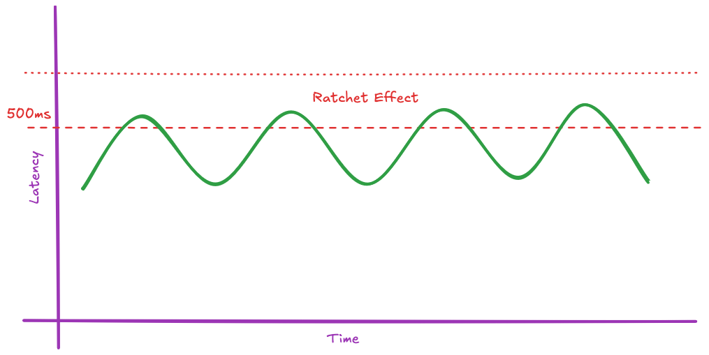
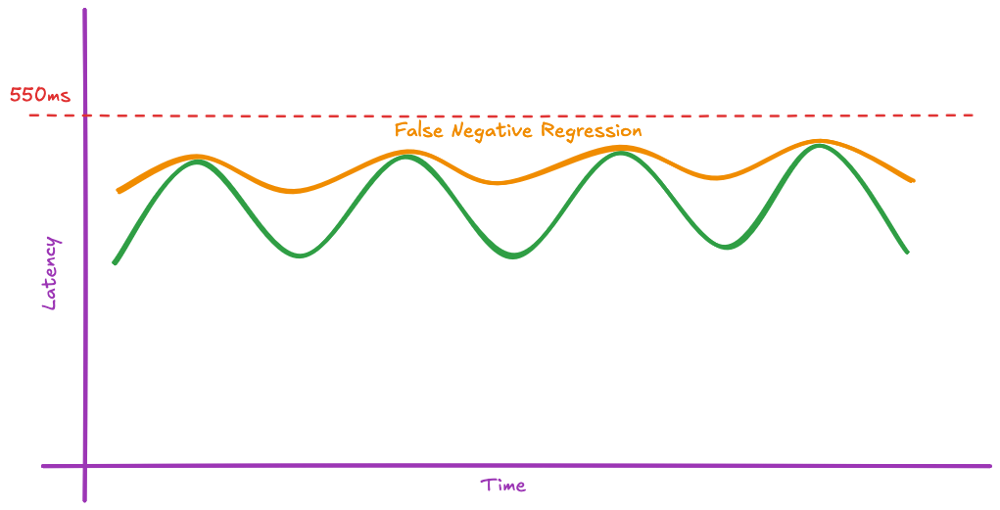

Monitoring static thresholds like `Latency < 500ms` for release verification may feel safe, until you realise your `P50` has drifted from `280ms` to `460ms` over six months and not a single deployment was flagged. No alert fired because no individual release breached the limit. But collectively, twelve "passing" releases compounded into a regression that customers noticed before your monitoring did.

Thresholds are great for availability monitoring (is the service down?). They're far less useful for release verification (is this code better than what's running now?). Relying on them alone introduces two long-term risks: silent performance degradation ("Boiling the Frog" 🐸) and the "[Ratchet Effect](https://en.wikipedia.org/wiki/Ratchet_effect)".

> *The boiling frog is an apologue describing a frog being slowly boiled alive. The premise is that if a frog is put suddenly into boiling water, it will jump out, but if the frog is put in tepid water which is then brought to a boil slowly, it will not perceive the danger and will be cooked to death.* -- [Wikipedia](https://en.wikipedia.org/wiki/Boiling_frog)

Here we walk through the problem and how statistical Automated Canary Analysis (like [Spinnaker's ACA](https://spinnaker.io/docs/guides/user/canary/canary-overview/)) can help.

## 🔧 The Ratchet Effect

Thresholds are often **"magic numbers"** that rarely keep pace with changing infrastructure or performance optimisations. When an incident *does* force a threshold update, the tendency is to tune it above the new, higher peak.

For example, P99 latency spikes to 520ms during a major event. The team bumps the threshold to 600ms. Six months later, nobody remembers why it's 600ms.

This process of continuous manual adjustment means the deployment safety bar is consistently lowered over time, the metric becomes meaningless, and leads to alert fatigue.

## 🐸 Statistical Drift: Boiling the Frog

Thresholds miss small, incremental drops in performance. A new code version can be worse than the previous one but still remain below the arbitrary limit. Over successive deployments, these micro-regressions compound silently.

For example, if your latency threshold is 550ms:

1. Release A peaks at 350ms, troughs at 300ms (Pass).

2. Release B causes peaks to creep to 390ms (Pass).

3. Release C causes troughs to creep to 350ms (Pass).

Over time, your application slowly "boils" becoming significantly slower or less stable without ever triggering a failure. Thresholds catch critical failures but they don't prevent decay.

## 🐤 How Automated Canary Analysis (ACA) Helps

[Automated Canary Analysis (ACA)](https://spinnaker.io/docs/guides/user/canary/canary-overview/) directly solves these problems by replacing absolute limits with statistically rigorous, baseline-driven comparison.

Canary Analysis is fundamentally a scientific experiment, where a [baseline/control](https://en.wikipedia.org/wiki/Scientific_control) version is used to minimise the influence of external variables.

### Baselines are Context Aware

Production environments are inherently noisy. Daily traffic peaks and troughs, scheduled jobs run, and third-party dependencies cause predictable (and unpredictable) spikes.

⚠️ Static thresholds must bake in wide tolerances to avoid failing during peak times.

The ACA baseline acts as a **control variable**. If traffic surges and both the Canary and the Baseline experience an identical 10% increase in latency, ACA calculates that there is zero performance deviation and passes the deployment. This relative approach minimises false positives and allows you to confidently attribute performance changes *only* to your new code.

### Baselines are Maintenance Free

Because ACA relies on a live production baseline as a control, it is self-tuning.

As infrastructure is optimised or dependencies change, the baseline automatically adjusts. You eliminate the need to constantly groom threshold numbers, drastically reducing operational toil.

📈 This eliminates the "ratchet" effect and essentially keeps the experiment meaningful.

### Statistical Analysis

Spinnaker Kayenta employs the **Mann-Whitney U** test to classify each metric by determining whether the canary and baseline distributions differ significantly. This non-parametric test is ideal because it doesn't assume normally distributed data. To quantify *how much* the distributions differ, Kayenta uses an effect size measure - **mean-ratio** by default, with **CLES** as an alternative.

| | Mean-Ratio | CLES |
|---|---|---|
| **Output** | Relative multiplier (e.g. 1.05 = 5% higher mean). | Probability (0.0-1.0) |
| **Question** | By what factor did the mean change between Canary and Baseline? | What is the probability that a random Canary value exceeds a random Baseline value? |
| **Strength** | Intuitive for stable, normally-distributed metrics. | Robust to skew, outliers, and zero-heavy distributions. |
| **Recommended Metrics** | Stable, non-zero metrics (e.g., CPU, memory, throughput) with a consistent baseline floor. | Sparse or spiky metrics (e.g., error counts, tail latency) where the baseline may be zero or have long tails. |

This statistical approach provides a quantifiable level of confidence that incremental degradation has occurred (or not occurred), effectively preventing the "Boiling Frog" syndrome before it reaches an arbitrary limit.

These algorithms require many data points and rely on long runs to prove their statistical significance.

### Trade-offs

ACA isn't free. It requires running a baseline alongside your canary during analysis, which means additional infrastructure cost for the duration of the evaluation window. The Mann-Whitney U test needs volume; services with low traffic or infrequent deployments may not generate enough data points for statistically meaningful results.

These are solvable problems. Baseline cost is temporary and bounded to the analysis window. Low-traffic services can extend their evaluation period or fall back to threshold checks. A degraded baseline is still better than a stale threshold and guarantees you're not making things worse.

## Conclusion

Thresholds and ACA solve different problems. Thresholds are a safety net, they catch catastrophic failures and answer "is the service down?" ACA is a quality gate, it catches the incremental decay that thresholds miss and answers "did this release make things worse?"

The two approaches are complementary, not mutually exclusive. Keep your critical thresholds for hard availability limits (error rate > 5%, latency > 2s), but don't mistake them for release verification.

💡The fundamental question shifts from: *"Are things currently bad?"* to: *"Did we make things worse?"*
